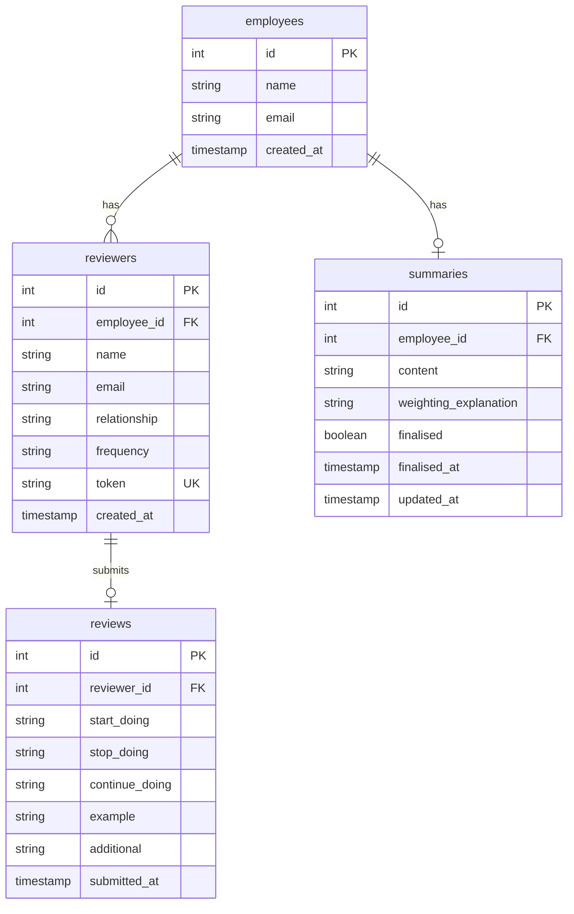

# feat: 360 Feedback Summarisation Tool MVP

## Overview

Build a lightweight prototype for 360-degree feedback collection where employees nominate reviewers, reviewers submit structured feedback via unique token links, and managers view weighted AI-generated summaries.

**Priority**: Working happy-path > polish/edge cases

---

## Problem Statement

360-degree feedback collection is typically manual, inconsistent, and lacks intelligent synthesis. This MVP demonstrates how structured feedback with relationship/frequency weighting can produce more meaningful AI-generated summaries for performance reviews.

---

## Proposed Solution

A four-flow web application:

1. **Employee Flow** (`/nominate`): Nominate 3-6 reviewers with relationship type and collaboration frequency
2. **Reviewer Flow** (`/review/{token}`): Submit structured feedback via unique token link
3. **Inbox Flow** (`/inbox/{email}`): View all pending reviews for an email address
4. **Manager Flow** (`/manager/{employee_id}`): View progress, edit AI summary, finalise

---

## Technical Approach

### Architecture

```
┌─────────────────┐     ┌─────────────────┐     ┌─────────────────┐
│  Static HTML/JS │────▶│   FastAPI API   │────▶│     SQLite      │
│   (Frontend)    │     │   (Backend)     │     │   (Database)    │
└─────────────────┘     └────────┬────────┘     └─────────────────┘
                                 │
                                 ▼
                        ┌─────────────────┐
                        │   Claude API    │
                        │ (Summarisation) │
                        └─────────────────┘
```

### Tech Stack

| Layer | Choice | Rationale |
|-------|--------|-----------|
| Frontend | Static HTML/JS | No build step, fast iteration |
| Backend | FastAPI (Python) | Lightweight, excellent Claude SDK support |
| Database | SQLite | Reliable, easy seeding, zero setup |
| AI | Claude API (claude-sonnet-4-5-20250514) | Fast, cost-effective summarisation |

### Database Schema

```sql
-- employees table
CREATE TABLE employees (
    id INTEGER PRIMARY KEY AUTOINCREMENT,
    name TEXT NOT NULL,
    email TEXT NOT NULL,
    created_at TIMESTAMP DEFAULT CURRENT_TIMESTAMP
);

-- reviewers table (linked to employees)
CREATE TABLE reviewers (
    id INTEGER PRIMARY KEY AUTOINCREMENT,
    employee_id INTEGER NOT NULL REFERENCES employees(id),
    name TEXT NOT NULL,
    email TEXT NOT NULL,
    relationship TEXT NOT NULL CHECK(relationship IN ('manager', 'peer', 'direct_report', 'xfn')),
    frequency TEXT NOT NULL CHECK(frequency IN ('weekly', 'monthly', 'rarely')),
    token TEXT UNIQUE NOT NULL,
    created_at TIMESTAMP DEFAULT CURRENT_TIMESTAMP
);

-- reviews table (feedback submissions)
CREATE TABLE reviews (
    id INTEGER PRIMARY KEY AUTOINCREMENT,
    reviewer_id INTEGER NOT NULL REFERENCES reviewers(id),
    start_doing TEXT NOT NULL,
    stop_doing TEXT NOT NULL,
    continue_doing TEXT NOT NULL,
    example TEXT NOT NULL,
    additional TEXT,
    submitted_at TIMESTAMP DEFAULT CURRENT_TIMESTAMP
);

-- summaries table (AI-generated, manager-editable)
CREATE TABLE summaries (
    id INTEGER PRIMARY KEY AUTOINCREMENT,
    employee_id INTEGER NOT NULL REFERENCES employees(id),
    content TEXT NOT NULL,
    weighting_explanation TEXT,
    finalised BOOLEAN DEFAULT FALSE,
    finalised_at TIMESTAMP,
    updated_at TIMESTAMP DEFAULT CURRENT_TIMESTAMP
);
```

### ERD



### Weighting Logic

**Combined weight** = `relationship_weight × frequency_weight`

| Relationship | Weight | | Frequency | Weight |
|--------------|--------|-|-----------|--------|
| Manager | 1.0 | | Weekly | 1.0 |
| Peer | 0.8 | | Monthly | 0.7 |
| Direct Report | 0.7 | | Rarely | 0.4 |
| Cross-functional | 0.6 | | | |

---

## Implementation Phases

### Phase 1: Project Setup & Database

**Files to create:**
- `requirements.txt`
- `app/main.py` (FastAPI app entry)
- `app/database.py` (SQLite connection + schema)
- `app/models.py` (Pydantic request/response models)
- `.env.example`

**Tasks:**
- [ ] Create project structure
- [ ] Set up FastAPI with CORS and static file serving
- [ ] Create SQLite database with schema
- [ ] Add seed data for demo (Alex Chen + 4 reviewers)

### Phase 2: API Routes

**Files to create/modify:**
- `app/routes/employees.py`
- `app/routes/review.py`
- `app/routes/inbox.py`
- `app/routes/manager.py`

**Endpoints:**
- [ ] `POST /api/employees` - Create employee + start review cycle
- [ ] `POST /api/employees/{id}/reviewers` - Add reviewer with UUID token
- [ ] `GET /api/review/{token}` - Get review context (employee name, relationship)
- [ ] `POST /api/review/{token}` - Submit feedback
- [ ] `GET /api/inbox/{email}` - List pending reviews for email
- [ ] `GET /api/manager/{employee_id}` - Get reviewers, statuses, summary
- [ ] `PUT /api/manager/{employee_id}/summary` - Edit summary
- [ ] `POST /api/manager/{employee_id}/finalise` - Lock summary

### Phase 3: AI Summarisation

**Files to create:**
- `app/services/summarisation.py`

**Tasks:**
- [ ] Implement Claude API integration
- [ ] Build weighted feedback prompt
- [ ] Generate summary with 4 sections (Strengths, Growth Areas, Key Examples, Suggested Focus)
- [ ] Generate weighting explanation
- [ ] Trigger summary when 2+ reviews submitted

### Phase 4: Frontend Pages

**Files to create:**
- `static/index.html` (landing/navigation)
- `static/nominate.html` (employee nominates reviewers)
- `static/review.html` (reviewer submits feedback)
- `static/inbox.html` (reviewer inbox)
- `static/manager.html` (manager dashboard)
- `static/js/app.js` (shared utilities)
- `static/css/style.css` (minimal styling)

**Pages:**
- [ ] `/nominate` - Form to add 3-6 reviewers with relationship + frequency
- [ ] `/review/{token}` - Structured feedback form (start/stop/continue + example)
- [ ] `/inbox/{email}` - List of pending reviews with links
- [ ] `/manager/{employee_id}` - Progress table, AI summary, edit, finalise

### Phase 5: Integration & Demo

**Tasks:**
- [ ] Seed database with test data (Alex Chen, 4 reviewers, 3 submitted)
- [ ] Verify end-to-end happy path
- [ ] Test summary generation with seeded data

---

## File Structure

```
360-feedback-tool/
├── .env.example                 # Environment variables template
├── requirements.txt             # Python dependencies
├── app/
│   ├── __init__.py
│   ├── main.py                  # FastAPI app entry point
│   ├── database.py              # SQLite connection + schema + seed
│   ├── models.py                # Pydantic models
│   ├── routes/
│   │   ├── __init__.py
│   │   ├── employees.py         # POST /api/employees, /api/employees/{id}/reviewers
│   │   ├── review.py            # GET/POST /api/review/{token}
│   │   ├── inbox.py             # GET /api/inbox/{email}
│   │   └── manager.py           # GET/PUT/POST /api/manager/{employee_id}/*
│   └── services/
│       ├── __init__.py
│       └── summarisation.py     # Claude API integration
├── static/
│   ├── index.html               # Landing page with navigation
│   ├── nominate.html            # Employee nomination form
│   ├── review.html              # Reviewer feedback form
│   ├── inbox.html               # Reviewer inbox
│   ├── manager.html             # Manager dashboard
│   ├── css/
│   │   └── style.css
│   └── js/
│       └── app.js               # Shared JS utilities
└── feedback.db                  # SQLite database (auto-created)
```

---

## Acceptance Criteria

### Functional Requirements

- [ ] Employee can add 3-6 reviewers with relationship type + frequency
- [ ] Unique UUID tokens generated for each reviewer
- [ ] Reviewer can access form via token link and see employee context
- [ ] Reviewer can submit structured feedback (start/stop/continue + example)
- [ ] Reviewer inbox shows all pending reviews for an email
- [ ] Manager sees reviewer list with submission status
- [ ] Summary auto-generates when 2+ reviews exist
- [ ] Summary grouped into 4 sections (Strengths, Growth Areas, Key Examples, Suggested Focus)
- [ ] Weighting applied based on relationship × frequency
- [ ] Weighting explanation shown to manager
- [ ] Manager can edit summary content
- [ ] Manager can regenerate summary
- [ ] Finalise locks the summary from further editing

### Non-Functional Requirements

- [ ] All API endpoints return JSON with appropriate status codes
- [ ] Frontend works without build step (vanilla HTML/JS)
- [ ] Database seeded with test data on startup

---

## Key Decisions & Assumptions

### Decisions Made

1. **Single main.py approach** - For MVP, keeping routes in single file is acceptable. Split only if exceeding ~300 lines.

2. **UUID tokens via `secrets.token_urlsafe(32)`** - Cryptographically secure, URL-safe, 256 bits of entropy.

3. **Summary regeneration** - "Regenerate" button explicitly re-runs AI. New reviews after initial generation do NOT auto-update summary (preserves manager edits).

4. **Finalization** - Locks summary editing only. New review submissions still accepted but ignored in finalized summary.

5. **No authentication** - URLs are public. Acceptable for MVP demo.

### Assumptions

1. **Token never expires** - Perpetual validity for MVP simplicity.
2. **Submissions immutable** - Reviewer cannot edit after submitting.
3. **Duplicate reviewers prevented** - Same email cannot be nominated twice for same employee.
4. **Text field limits** - 2000 chars for main fields, enforced client-side.

---

## Out of Scope

Explicitly excluded from MVP:

- Authentication / login
- Email sending
- Multiple review cycles per employee
- Edge case handling
- Responsive design / styling polish
- PDF export
- Reminder nudges
- Audio input

---

## Test Data (Pre-seed)

**Employee**: Alex Chen (alex.chen@company.com)

| Reviewer | Relationship | Frequency | Status | Token |
|----------|--------------|-----------|--------|-------|
| Sam Taylor | Manager | Weekly | Submitted | `sam-taylor-token-xxx` |
| Jordan Lee | Peer | Weekly | Submitted | `jordan-lee-token-xxx` |
| Casey Morgan | Direct Report | Monthly | Submitted | `casey-morgan-token-xxx` |
| Riley Kumar | Cross-functional | Rarely | Pending | `riley-kumar-token-xxx` |

This ensures summary generation works immediately in demo (3 submitted reviews).

---

## Demo Flow (2-3 min)

1. **Employee view** (30s): Show `/nominate`, add a new reviewer, copy token link
2. **Reviewer inbox** (30s): Show `/inbox/{email}` with pending reviews
3. **Reviewer form** (30s): Submit structured feedback via `/review/{token}`
4. **Manager dashboard** (60s): Show progress at `/manager/{employee_id}`, view weighted summary, explain weighting, edit, finalise

---

## Dependencies

```txt
fastapi>=0.115.0
uvicorn[standard]>=0.30.0
anthropic>=0.39.0
python-dotenv>=1.0.0
```

---

## Running the Application

```bash
# Install dependencies
pip install -r requirements.txt

# Set environment variable
export ANTHROPIC_API_KEY=your_key_here

# Run server
uvicorn app.main:app --reload --port 8000

# Access at http://localhost:8000
```

---

## References

### Internal
- `MVP PRD.md` - Full product requirements
- `360-feedback-flow.mermaid` - Visual flow diagram
- `CLAUDE.md` - Project conventions

### External
- [FastAPI Documentation](https://fastapi.tiangolo.com/)
- [Anthropic Python SDK](https://github.com/anthropics/anthropic-sdk-python)
- [Python secrets module](https://docs.python.org/3/library/secrets.html)
