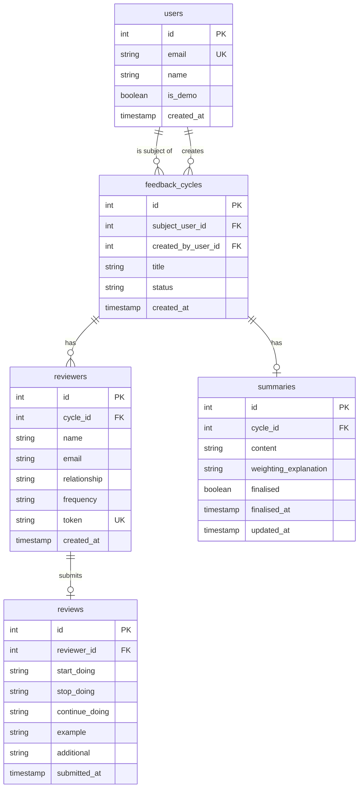

# 360 Feedback Tool Improvements

## Overview

Solve three issues with a unified approach using email-based user accounts and persistent storage:

1. **Persona confusion** → User accounts provide identity and role context
2. **Demo data in production** → Demo data scoped to demo accounts only
3. **Data wiping on Vercel** → Vercel Postgres for persistence

---

## Decisions

| Decision | Choice |
|----------|--------|
| Database | Vercel Postgres |
| Demo email domain | `@demo.360feedback` |
| URL structure | `/cycle/{id}` |
| Scope | Phase 1-2 (Database + Users) |

---

## Core Concept: Email-Based Identity

Users "log in" by entering their email address (no password for MVP). This provides:

- **Identity**: Know who is viewing the app
- **Role context**: Same person can be employee AND reviewer
- **Data scoping**: Demo data isolated to demo accounts
- **Navigation**: Show relevant views based on user context

### User Flow

```
Landing Page
     ↓
"Enter your email to continue"
     ↓
[user enters: jane@company.com]
     ↓
Dashboard showing:
  - "My Feedback Cycles" (cycles where I'm the subject)
  - "My Pending Reviews" (reviews I need to complete)
```

---

## Schema

### ERD



### SQL Schema

```sql
CREATE TABLE users (
    id SERIAL PRIMARY KEY,
    email TEXT UNIQUE NOT NULL,
    name TEXT NOT NULL,
    is_demo BOOLEAN DEFAULT FALSE,
    created_at TIMESTAMP DEFAULT NOW()
);

CREATE TABLE feedback_cycles (
    id SERIAL PRIMARY KEY,
    subject_user_id INTEGER NOT NULL REFERENCES users(id),
    created_by_user_id INTEGER NOT NULL REFERENCES users(id),
    title TEXT,
    status TEXT DEFAULT 'active',
    created_at TIMESTAMP DEFAULT NOW()
);

CREATE TABLE reviewers (
    id SERIAL PRIMARY KEY,
    cycle_id INTEGER NOT NULL REFERENCES feedback_cycles(id),
    name TEXT NOT NULL,
    email TEXT NOT NULL,
    relationship TEXT NOT NULL CHECK(relationship IN ('manager', 'peer', 'direct_report', 'xfn')),
    frequency TEXT NOT NULL CHECK(frequency IN ('weekly', 'monthly', 'rarely')),
    token TEXT UNIQUE NOT NULL,
    created_at TIMESTAMP DEFAULT NOW()
);

CREATE TABLE reviews (
    id SERIAL PRIMARY KEY,
    reviewer_id INTEGER NOT NULL REFERENCES reviewers(id),
    start_doing TEXT NOT NULL,
    stop_doing TEXT NOT NULL,
    continue_doing TEXT NOT NULL,
    example TEXT NOT NULL,
    additional TEXT,
    submitted_at TIMESTAMP DEFAULT NOW()
);

CREATE TABLE summaries (
    id SERIAL PRIMARY KEY,
    cycle_id INTEGER NOT NULL REFERENCES feedback_cycles(id),
    content TEXT NOT NULL,
    weighting_explanation TEXT,
    finalised BOOLEAN DEFAULT FALSE,
    finalised_at TIMESTAMP,
    updated_at TIMESTAMP DEFAULT NOW()
);

CREATE INDEX idx_feedback_cycles_subject ON feedback_cycles(subject_user_id);
CREATE INDEX idx_reviewers_cycle ON reviewers(cycle_id);
CREATE INDEX idx_reviewers_token ON reviewers(token);
CREATE INDEX idx_reviewers_email ON reviewers(email);
CREATE INDEX idx_reviews_reviewer ON reviews(reviewer_id);
CREATE INDEX idx_summaries_cycle ON summaries(cycle_id);
```

---

## Implementation Plan

### Phase 1: Vercel Postgres Migration

**Files to modify:**
- `requirements.txt` - Add `psycopg2-binary`
- `app/database.py` - Rewrite for PostgreSQL connection

**Steps:**
1. Create Vercel Postgres database via Vercel Dashboard → Storage → Create → Postgres
2. Copy connection string to Vercel environment variables (`POSTGRES_URL`)
3. Update `requirements.txt`:
   ```
   fastapi>=0.109.0
   uvicorn>=0.27.0
   anthropic>=0.18.0
   python-dotenv>=1.0.0
   psycopg2-binary>=2.9.9
   ```
4. Rewrite `app/database.py`:
   - Replace SQLite connection with PostgreSQL
   - Update schema creation for PostgreSQL syntax
   - Add connection pooling
5. Add `POSTGRES_URL` to local `.env` for testing
6. Test all existing endpoints work with new database

### Phase 2: Email-Based User System

**New files:**
- `app/routes/auth.py` - Login endpoint
- `static/dashboard.html` - User dashboard page

**Files to modify:**
- `app/main.py` - Add auth routes, dashboard route
- `app/database.py` - Add users table, seed demo users
- `static/index.html` - Add email login form
- `static/js/app.js` - Add user session management
- `app/routes/employees.py` - Rename to `cycles.py`, link to users

**Steps:**
1. Add `users` table to schema with `is_demo` flag
2. Create `POST /api/auth/login` endpoint:
   - Accept email and name
   - Find or create user
   - Return user object
3. Update `static/index.html`:
   - Add email input form
   - On submit, call login API
   - Store user in localStorage
   - Redirect to `/dashboard`
4. Create `static/dashboard.html`:
   - Show "My Feedback Cycles"
   - Show "My Pending Reviews"
   - "Start New Cycle" button
5. Update `static/js/app.js`:
   - Add `getUser()` function (reads localStorage)
   - Add `X-User-Email` header to all API requests
6. Rename `employees` → `feedback_cycles` in schema
7. Update `/api/employees` → `/api/cycles`
8. Seed demo users:
   ```
   alex@demo.360feedback (Alex Chen)
   sam@demo.360feedback (Sam Taylor)
   jordan@demo.360feedback (Jordan Lee)
   casey@demo.360feedback (Casey Morgan)
   riley@demo.360feedback (Riley Kumar)
   ```

---

## Page Structure (After Phase 2)

```
/                   → Landing page (email login form)
/dashboard          → User's personal dashboard
/nominate           → Create new feedback cycle (existing, updated)
/manager/{name}     → View cycle details (existing, rename later)
/review/{token}     → Submit feedback (existing, unchanged)
/inbox/{email}      → Pending reviews (existing, update to use logged-in user)
```

---

## Acceptance Criteria

### Phase 1: Database Migration
- [ ] Vercel Postgres database created and connected
- [ ] All existing endpoints work with PostgreSQL
- [ ] Data persists across deployments
- [ ] Data persists across cold starts
- [ ] Review links remain valid after redeployment

### Phase 2: User System
- [ ] Users can enter email on landing page to "log in"
- [ ] New emails automatically create user accounts
- [ ] User email persists in localStorage
- [ ] Dashboard shows user's own feedback cycles
- [ ] Dashboard shows user's pending reviews
- [ ] Demo users (`@demo.360feedback`) have pre-populated data
- [ ] Real users see empty state on first login

---

## Demo Data

Seed these demo users and one feedback cycle:

**Users:**
| Email | Name | is_demo |
|-------|------|---------|
| alex@demo.360feedback | Alex Chen | true |
| sam@demo.360feedback | Sam Taylor | true |
| jordan@demo.360feedback | Jordan Lee | true |
| casey@demo.360feedback | Casey Morgan | true |
| riley@demo.360feedback | Riley Kumar | true |

**Feedback Cycle:**
- Subject: Alex Chen
- Created by: Alex Chen
- Title: "Q4 2024 Review"
- Reviewers: Sam (manager), Jordan (peer), Casey (direct report), Riley (xfn)
- Reviews submitted: Sam, Jordan, Casey (3 of 4)
